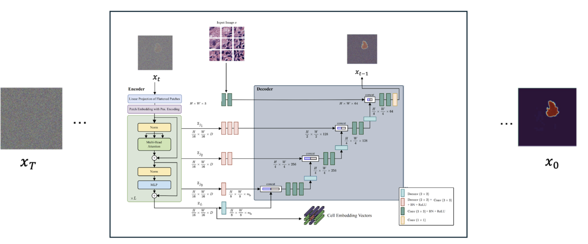

## CellViT Diffusion – Segmentation Pipeline

This repo contains a CellViT-based diffusion model for medical image segmentation, plus training, sampling, evaluation and demo scripts.



### 1. Environment Setup

- **Clone the repo**

```bash
git clone git@github.com:caesarchen000/cellvit_diffusion.git
cd cellvit_diffusion
```

- **Create and activate a Conda env (recommended)**

```bash
conda create -n cellvit_diffusion python=3.10 -y
conda activate cellvit_diffusion
```

- **Install Python dependencies**

Most code lives in `MedSegDiff` and `CellViT`. Install their requirements:

```bash
cd MedSegDiff
pip install -r requirements.txt

# If you have additional libs you know you need:
pip install opencv-python scipy scikit-learn visdom
```

Adjust versions as needed for your system / CUDA.

### 2. Dataset Layout

Training expects a **nested** dataset under `train/` (and optionally `test/`) at repo root:

```text
train/
  <ID>/
    images/
      <ID>.png          # input image
    masks/
      *.png             # one or more instance masks for this ID

test/
  <ID>/
    images/
      <ID>.png
    masks/
      *.png             # optional, used for evaluation
```

- Masks are **binary instance masks**; the training pipeline merges all instance masks for an ID into a single foreground/background mask.

### 3. Training

The main training entrypoint lives in `MedSegDiff`:

```bash
cd MedSegDiff
conda activate cellvit_diffusion   # if not already

python scripts/segmentation_train.py \
  --data_name CUSTOM \
  --data_dir ../train \
  --model_arch cellvit \
  --image_size 256 \
  --in_ch 4 \
  --batch_size 4 \
  --lr 5e-5 \
  --diffusion_steps 6000 \
  --log_interval 100 \
  --save_interval 5000 \
  --out_dir ./results/cellvit_diffusion_merged_masks \
  --gpu_dev 0 \
  --cellvit_embed_dim 384 \
  --cellvit_depth 12 \
  --cellvit_heads 6
```

Notes:
- `--data_dir` must point to the `train/` folder described above.
- Checkpoints are written into `results/...` as `savedmodel*.pt` and EMA checkpoints as `emasavedmodel_*.pt`.
- If you want to **resume** from a checkpoint:

```bash
python scripts/segmentation_train.py \
  ...same args as above... \
  --resume_checkpoint ./results/cellvit_diffusion_merged_masks/savedmodel155000.pt
```

There is also a helper shell script `scripts/train_cellvit_diffusion.sh` you can inspect and modify.

### 4. Sampling / Inference

To generate segmentation masks from a trained model:

```bash
cd MedSegDiff
conda activate cellvit_diffusion

bash scripts/sample_cellvit_diffusion_fast.sh
```

This script:
- Automatically finds the latest EMA checkpoint in `results/cellvit_diffusion_merged_masks`.
- Runs a relatively fast sampling configuration (few diffusion steps, few ensembles) and writes predictions into something like:
  - `results/cellvit_diffusion/samples_fast_debug/`

For higher-quality but slower sampling, use `scripts/sample_cellvit_diffusion.sh` and adjust:
- `DIFFUSION_STEPS`
- `NUM_ENSEMBLE`
- `THRESHOLD`

Both sampling scripts call `scripts/segmentation_sample.py`, which supports:
- `--num_samples`
- `--diffusion_steps`
- `--num_ensemble`
- `--post_process true|false`
- `--threshold 0.3` (for binarization)

### 5. Evaluation (IoU / Dice / AP)

To quantitatively evaluate predictions against merged ground-truth masks, use:

```bash
cd MedSegDiff
conda activate cellvit_diffusion

python scripts/evaluate_iou.py \
  --pred_dir ./results/cellvit_diffusion/samples_fast_debug \
  --data_dir ../train \
  --threshold 0.5
```

This script:
- Matches each prediction `<ID>_output*.jpg` in `pred_dir` to the corresponding ID in `data_dir`.
- Merges all instance masks for that ID.
- Computes per-sample and mean **IoU**, **Dice**, and **Average Precision (AP)**.

### 6. Demo Triptych (Input | GT | Prediction)

To generate demo images showing input, merged ground truth, and prediction side-by-side:

```bash
cd MedSegDiff
conda activate cellvit_diffusion

python scripts/make_demo_triptych.py \
  --pred_dir ./results/cellvit_diffusion/samples_fast_debug \
  --data_dir ../train \
  --out_dir ./results/cellvit_diffusion/demo_triptych
```

Each output image in `demo_triptych/` will look like:

```text
[ input RGB | merged GT mask | predicted mask ]
```

### 7. Notes / Tips

- Large folders `train/`, `test/`, and `results/` are git-ignored so they are not pushed to GitHub.
  - Each user should create their own `train/` and `test/` folders locally.
- If you encounter CUDA OOM, reduce `--batch_size` or image size.
- For multi-GPU or DDP, you can extend the training script to launch with `torch.distributed.launch` or `torchrun`.

For any questions about configuration or extending the model, check the scripts in `MedSegDiff/scripts` and the training utilities in `MedSegDiff/guided_diffusion`.


